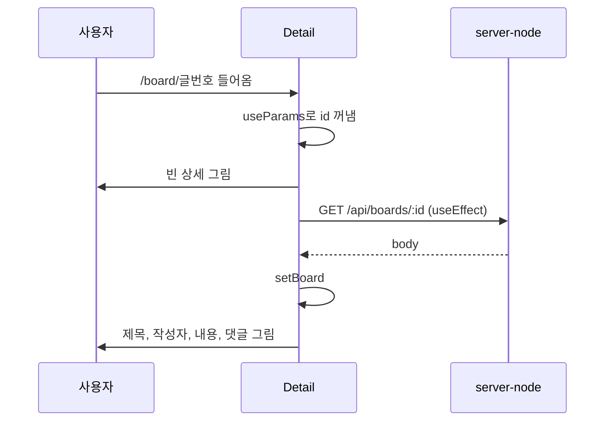

# board-detail 흐름

```mermaid
sequenceDiagram
  participant U as 사용자
  participant D as Detail
  participant S as server-node
  U->>D: /board/글번호 들어옴
  D->>D: useParams로 id 꺼냄
  D->>U: 빈 상세 그림
  D->>S: GET /api/boards/:id (useEffect)
  S-->>D: body
  D->>D: setBoard
  D->>U: 제목, 작성자, 내용, 댓글 그림
```
