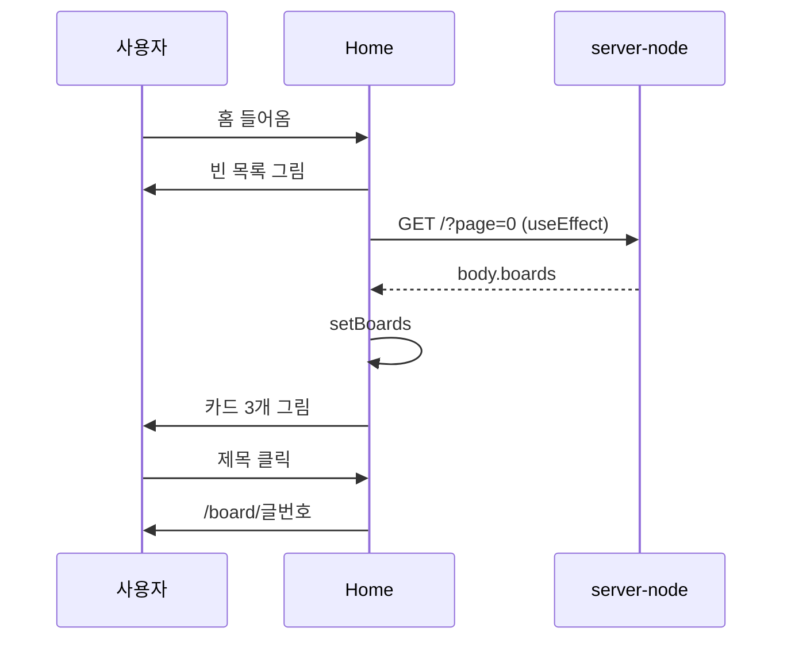

# board-list 흐름

```mermaid
sequenceDiagram
  participant U as 사용자
  participant H as Home
  participant S as server-node
  U->>H: 홈 들어옴
  H->>U: 빈 목록 그림
  H->>S: GET /?page=0 (useEffect)
  S-->>H: body.boards
  H->>H: setBoards
  H->>U: 카드 3개 그림
  U->>H: 제목 클릭
  H->>U: /board/글번호
```
