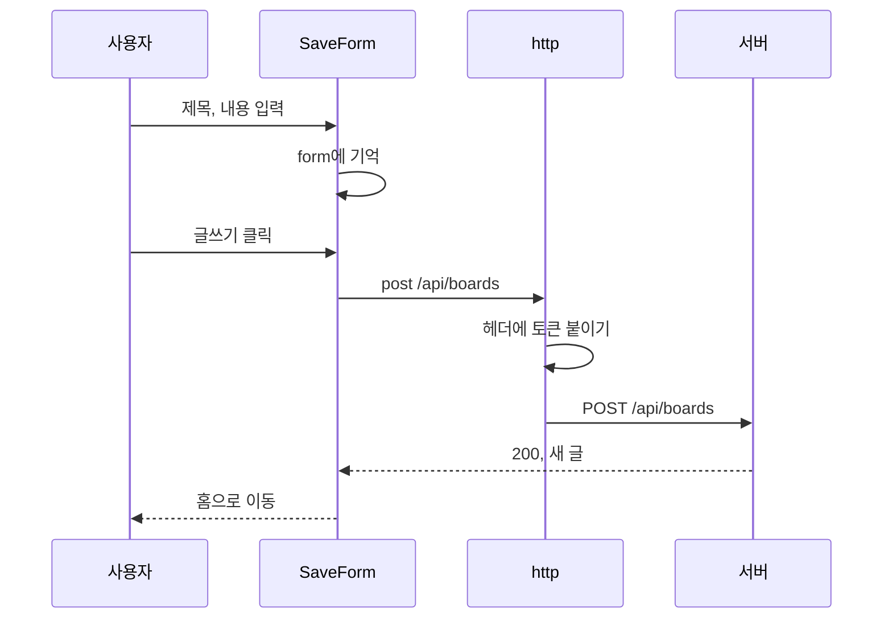

# board-save 흐름

```mermaid
sequenceDiagram
  participant U as 사용자
  participant S as SaveForm
  participant H as http
  participant B as 서버
  U->>S: 제목, 내용 입력
  S->>S: form에 기억
  U->>S: 글쓰기 클릭
  S->>H: post /api/boards
  H->>H: 헤더에 토큰 붙이기
  H->>B: POST /api/boards
  B-->>S: 200, 새 글
  S-->>U: 홈으로 이동
```
