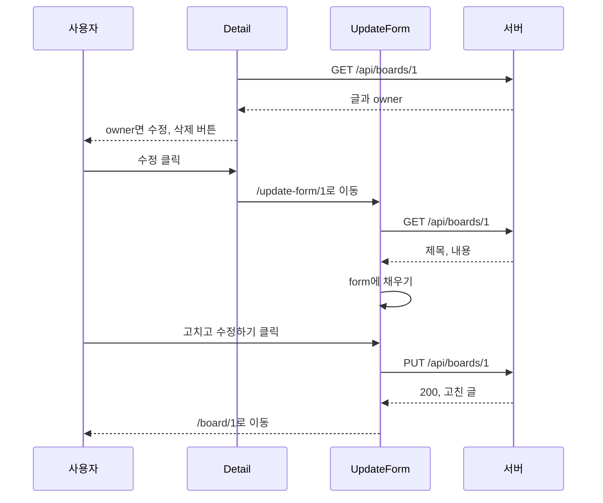
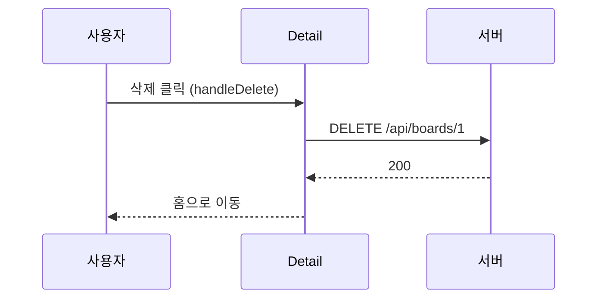

# board-update-delete 흐름

## 수정

```mermaid
sequenceDiagram
  participant U as 사용자
  participant D as Detail
  participant F as UpdateForm
  participant B as 서버
  D->>B: GET /api/boards/1
  B-->>D: 글과 owner
  D-->>U: owner면 수정, 삭제 버튼
  U->>D: 수정 클릭
  D->>F: /update-form/1로 이동
  F->>B: GET /api/boards/1
  B-->>F: 제목, 내용
  F->>F: form에 채우기
  U->>F: 고치고 수정하기 클릭
  F->>B: PUT /api/boards/1
  B-->>F: 200, 고친 글
  F-->>U: /board/1로 이동
```

## 삭제

```mermaid
sequenceDiagram
  participant U as 사용자
  participant D as Detail
  participant B as 서버
  U->>D: 삭제 클릭 (handleDelete)
  D->>B: DELETE /api/boards/1
  B-->>D: 200
  D-->>U: 홈으로 이동
```
