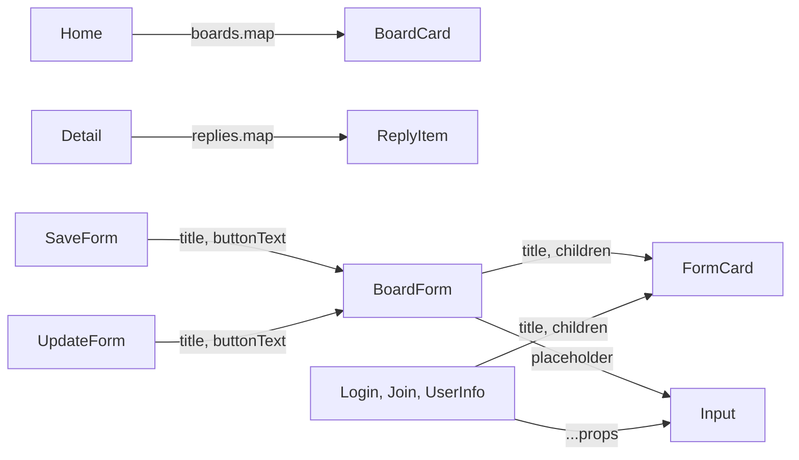

# component-split 흐름

화면이 조각에 props를 넘긴다.

```mermaid
flowchart LR
  H[Home] -->|"boards.map"| BC[BoardCard]
  D[Detail] -->|"replies.map"| RI[ReplyItem]
  S[SaveForm] -->|"title, buttonText"| BF[BoardForm]
  U[UpdateForm] -->|"title, buttonText"| BF
  BF -->|"title, children"| FC[FormCard]
  BF -->|"placeholder"| IN[Input]
  F["Login, Join, UserInfo"] -->|"title, children"| FC
  F -->|"...props"| IN
```
