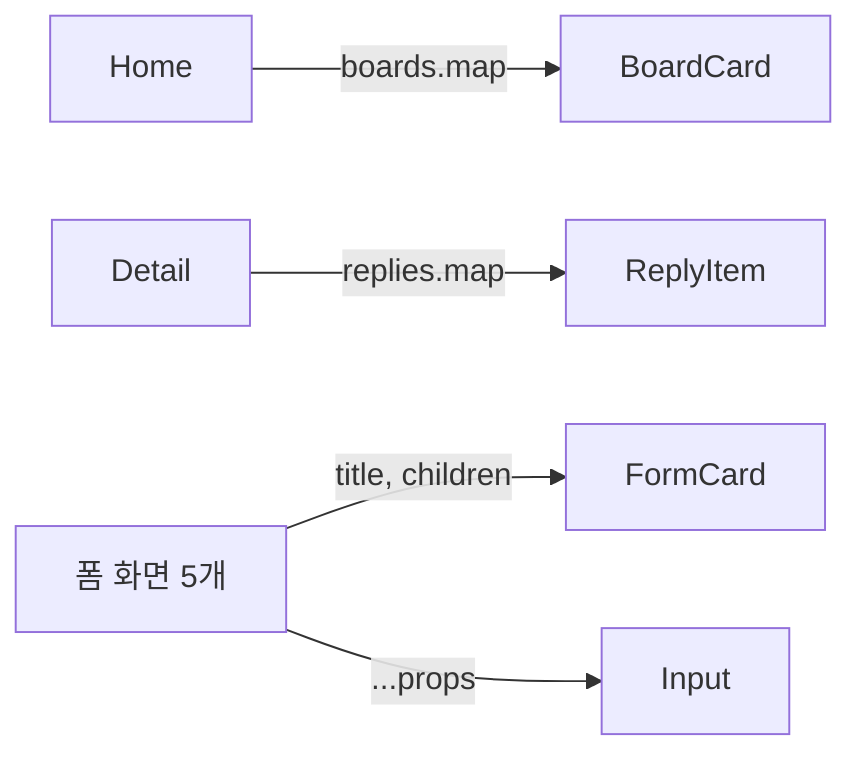

# component-split 흐름

화면이 조각에 props를 넘긴다.
폼 화면 5개는 LoginForm, JoinForm, UserInfo, SaveForm, UpdateForm이다.

```mermaid
flowchart LR
  H[Home] -->|"boards.map"| BC[BoardCard]
  D[Detail] -->|"replies.map"| RI[ReplyItem]
  F[폼 화면 5개] -->|"title, children"| FC[FormCard]
  F -->|"...props"| IN[Input]
```
