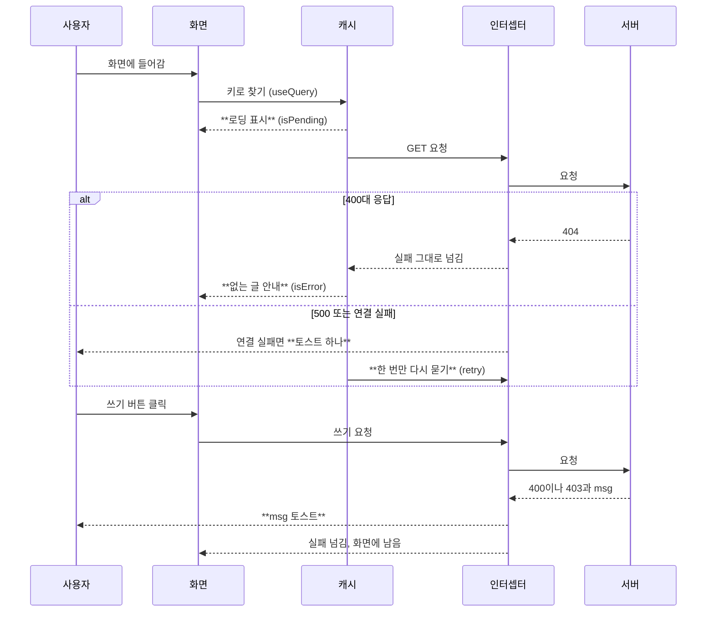

# error-handling 흐름

조회는 받는 동안 로딩을 보이고, 실패하면 화면이 안내한다.
쓰기 실패와 연결 실패는 http 응답 인터셉터가 토스트로 알리고 그 화면에 남는다.
다시 묻기는 400대면 하지 않고, 500과 연결 실패는 한 번만 한다.
없는 주소는 path="*" 라우트가 받아 헤더 아래에 안내한다.

```mermaid
sequenceDiagram
  participant U as 사용자
  participant S as 화면
  participant Q as 캐시
  participant H as 인터셉터
  participant B as 서버
  U->>S: 화면에 들어감
  S->>Q: 키로 찾기 (useQuery)
  Q-->>S: **로딩 표시** (isPending)
  Q->>H: GET 요청
  H->>B: 요청
  alt 400대 응답
    B-->>H: 404
    H-->>Q: 실패 그대로 넘김
    Q-->>S: **없는 글 안내** (isError)
  else 500 또는 연결 실패
    H-->>U: 연결 실패면 **토스트 하나**
    Q->>H: **한 번만 다시 묻기** (retry)
  end
  U->>S: 쓰기 버튼 클릭
  S->>H: 쓰기 요청
  H->>B: 요청
  B-->>H: 400이나 403과 msg
  H-->>U: **msg 토스트**
  H-->>S: 실패 넘김, 화면에 남음
```
