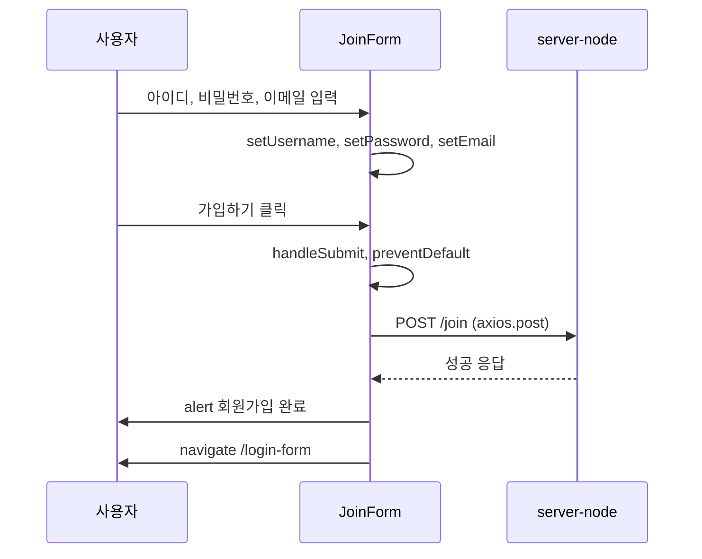

# join 흐름

```mermaid
sequenceDiagram
  participant U as 사용자
  participant J as JoinForm
  participant S as server-node
  U->>J: 아이디, 비밀번호, 이메일 입력
  J->>J: setUsername, setPassword, setEmail
  U->>J: 가입하기 클릭
  J->>J: handleSubmit, preventDefault
  J->>S: POST /join (axios.post)
  S-->>J: 성공 응답
  J->>U: alert 회원가입 완료
  J->>U: navigate /login-form
```
