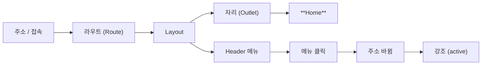

# layout 흐름

```mermaid
flowchart LR
  A[주소 / 접속] --> B["라우트 (Route)"]
  B --> C[Layout]
  C --> D[Header 메뉴]
  C --> E["자리 (Outlet)"]
  E --> F[**Home**]
  D --> G[메뉴 클릭]
  G --> H[주소 바뀜]
  H --> I["강조 (active)"]
```
