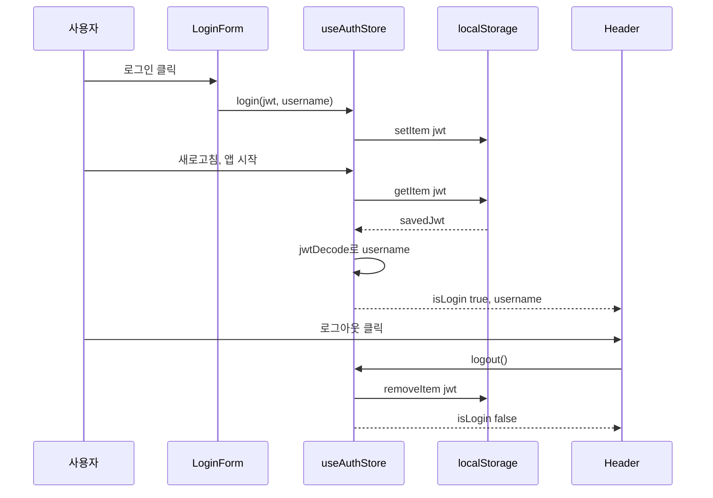

# login-keep 흐름

```mermaid
sequenceDiagram
  participant U as 사용자
  participant L as LoginForm
  participant A as useAuthStore
  participant B as localStorage
  participant H as Header
  U->>L: 로그인 클릭
  L->>A: login(jwt, username)
  A->>B: setItem jwt
  U->>A: 새로고침, 앱 시작
  A->>B: getItem jwt
  B-->>A: savedJwt
  A->>A: jwtDecode로 username
  A-->>H: isLogin true, username
  U->>H: 로그아웃 클릭
  H->>A: logout()
  A->>B: removeItem jwt
  A-->>H: isLogin false
```
