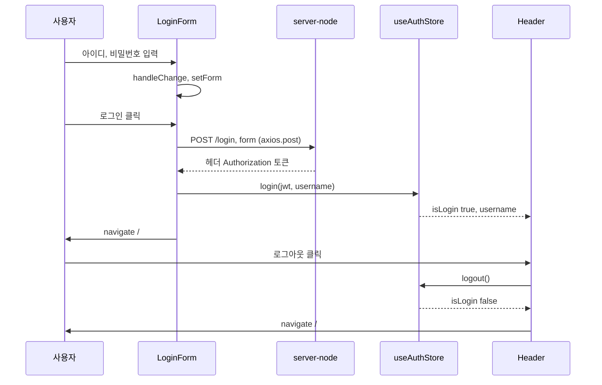

# login 흐름

```mermaid
sequenceDiagram
  participant U as 사용자
  participant L as LoginForm
  participant S as server-node
  participant A as useAuthStore
  participant H as Header
  U->>L: 아이디, 비밀번호 입력
  L->>L: handleChange, setForm
  U->>L: 로그인 클릭
  L->>S: POST /login, form (axios.post)
  S-->>L: 헤더 Authorization 토큰
  L->>A: login(jwt, username)
  A-->>H: isLogin true, username
  L->>U: navigate /
  U->>H: 로그아웃 클릭
  H->>A: logout()
  A-->>H: isLogin false
  H->>U: navigate /
```
