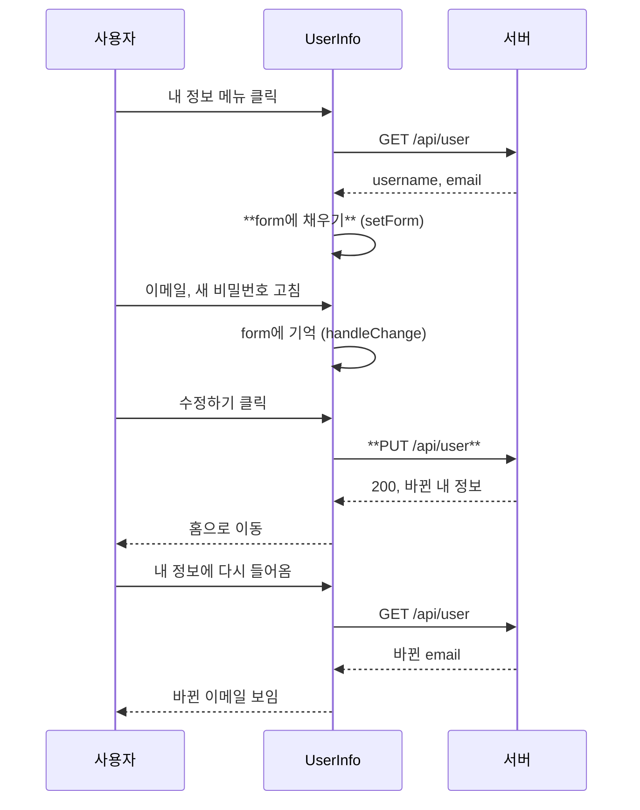

# my-info 흐름

```mermaid
sequenceDiagram
  participant U as 사용자
  participant I as UserInfo
  participant B as 서버
  U->>I: 내 정보 메뉴 클릭
  I->>B: GET /api/user
  B-->>I: username, email
  I->>I: **form에 채우기** (setForm)
  U->>I: 이메일, 새 비밀번호 고침
  I->>I: form에 기억 (handleChange)
  U->>I: 수정하기 클릭
  I->>B: **PUT /api/user**
  B-->>I: 200, 바뀐 내 정보
  I-->>U: 홈으로 이동
  U->>I: 내 정보에 다시 들어옴
  I->>B: GET /api/user
  B-->>I: 바뀐 email
  I-->>U: 바뀐 이메일 보임
```
