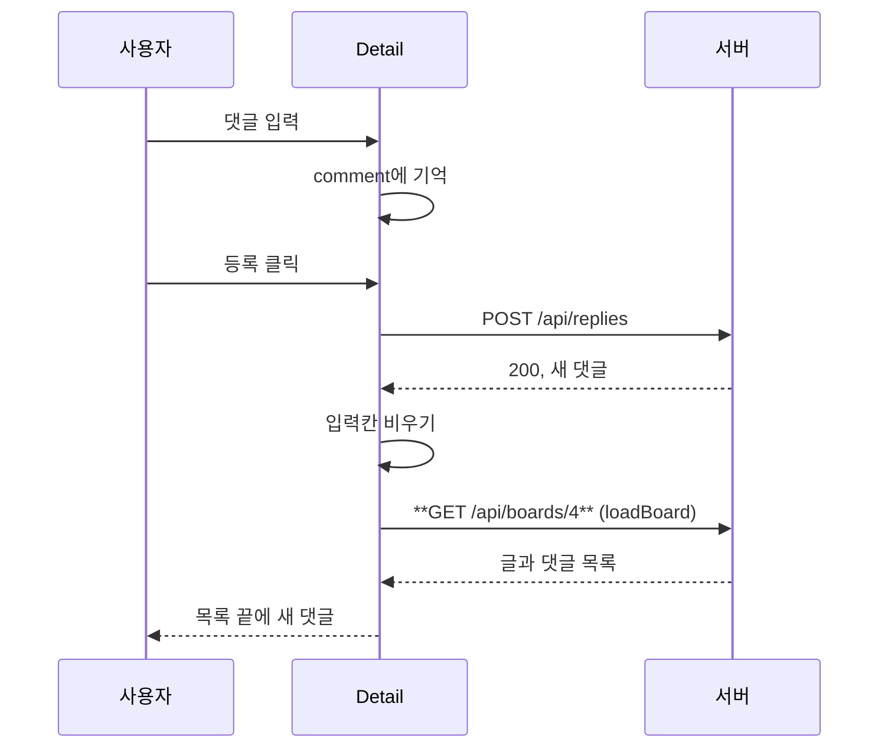
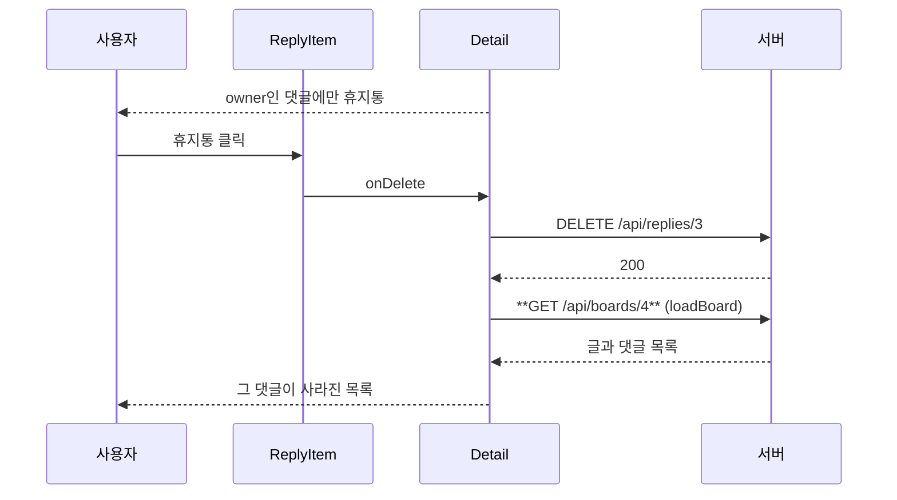

# reply 흐름

## 쓰기

```mermaid
sequenceDiagram
  participant U as 사용자
  participant D as Detail
  participant B as 서버
  U->>D: 댓글 입력
  D->>D: comment에 기억
  U->>D: 등록 클릭
  D->>B: POST /api/replies
  B-->>D: 200, 새 댓글
  D->>D: 입력칸 비우기
  D->>B: **GET /api/boards/4** (loadBoard)
  B-->>D: 글과 댓글 목록
  D-->>U: 목록 끝에 새 댓글
```

## 삭제

```mermaid
sequenceDiagram
  participant U as 사용자
  participant R as ReplyItem
  participant D as Detail
  participant B as 서버
  D-->>U: owner인 댓글에만 휴지통
  U->>R: 휴지통 클릭
  R->>D: onDelete
  D->>B: DELETE /api/replies/3
  B-->>D: 200
  D->>B: **GET /api/boards/4** (loadBoard)
  B-->>D: 글과 댓글 목록
  D-->>U: 그 댓글이 사라진 목록
```
