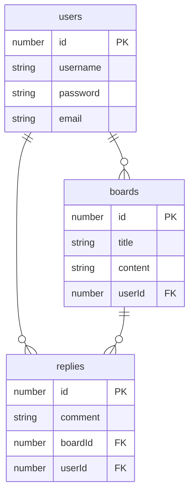

# ERD

기준: join 장

```mermaid
erDiagram
  users ||--o{ boards : ""
  users ||--o{ replies : ""
  boards ||--o{ replies : ""
  users {
    number id PK
    string username
    string password
    string email
  }
  boards {
    number id PK
    string title
    string content
    number userId FK
  }
  replies {
    number id PK
    string comment
    number boardId FK
    number userId FK
  }
```

이 장에서 바뀐 것
- users에 회원가입한 사용자가 저장된다
