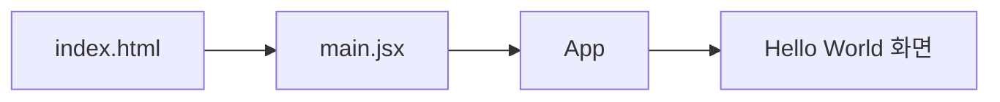

# 시나리오별 구조도

## 앱 띄우기

```mermaid
flowchart LR
  A[index.html] --> B[main.jsx]
  B --> C[App]
  C --> D[Hello World 화면]
```

만든 장: project-setup
맡는 파일
- react-blog/index.html
- react-blog/src/main.jsx
- react-blog/src/App.jsx

사용자 시나리오(회원가입, 로그인, 글쓰기)는 아직 만든 장이 없다.
